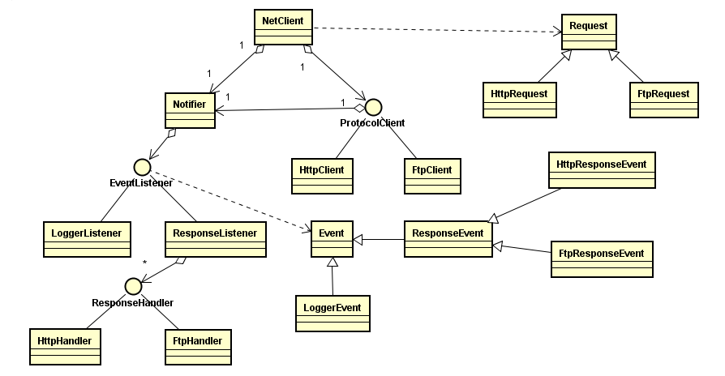

## 简单说明

这个项目实现unix环境下或者类unix环境下，使用c语言实现的本地异步网络客户端框架。

这个框架非常容易扩展新的协议，和对处理结果的处理。

## 构建

依赖unix环境或者类unix环境(主要是使用selector模型，如果是windows上，只需要实现自己的selector替换掉selector_posix.c，windows上应该有类似功能的api,需要自己进行适配, 然后在makefile中修改一下，暂时不提供windows支持，如果想使用windows下体验，推荐安装msys2, 本项目就是在msys2环境下开发的)，

依赖库：openssl, lualib，openssl提供了socket_openssl.c中异步socket操作的支持,lua_downloader.c中依赖lua的头文件和库文件，当构建好后，方便
使用test.lua来查看整个库的使用情况，方面整个框架的测试。

试下如下命令:

    make LUA_INCLUDE=lua头文件路径 LUA_LIB=lua库文件路径
  
会在netclient命令生成libnetclient.so, libnetclient.a, app[.exe], nc.so

其中：

- libnetclient.so, libnetclient.a 分别表示动态库和静态库文件
- app.[exe] 他是一个整体使用c来测试整个模块的样例
- nc.so 是netclient这个模块的一个lua易用绑定
- test.lua 是lua易用绑定的一个简单使用样例

## 整个软件结构说明

简单类图（只是说明各个模块之间的关系，方法都省略掉了），并且里面的接口和类都是使用结构体来实现的，具体可以看一下源码。比如想看EventListener接口定义，那么
看一下event_listener.h, 想看一下具体EventListener接口的一个具体实现类，那么看一下response_listener.[hc] , 他们应该是整个项目中最简单的c风格的接口
定义和实现。

## 各个模块和接口说明

### Event

Event 所有事件的基类（C继承是保证子类结构体的第一个参数是基类类型，就可以保存子类内存模型兼容父类内存模型），实现类有：
- LoggerEvent 日志事件，本框架通过事件将具体日志操作通知给对应日志监听器
- ResponseEvent 响应事件，当某个具体协议客户端完成整个通信流程的时候，有具体协议客户端(ProtocolClient)实现类来发出这个事件，并且不同协议可以发出
不同的响应事件,比如HttpProtocolClient可以发出HttpResponseEvent, FtpProtocolClient可以发出FtpResponseEvent
- 也支持其他事件类型，总之某个具体ProtocolClient可以发送自定义类型，只需要你添加对应事件类型的监听器就行，这儿是使用观察者模式，和基于事件模型弹性
的地方

### EventListener/Notifier

EventListener和Notifier他们之间使用的是观察者设计模式，EventListener是观察者，Notifier是被观察者

EventListener 是一个事件监听器接口，核心方法是handle, 用来处理对于各个事件的响应，一般内部要根据事件的类型和你期待的时间类型并且比较，如何符合
进行处理，如果不适合则不进行处理。主要有默认的实现：

- ResponseListener 他只接收ResponseEvent, 提供注册协议类型和对应处理回调函数的功能，然后当ResponseEvent被触发的时候，他会分发给对应的回调函数。
- LoggerListener 内部提供一个输出日志过滤级别，和对应的输出文件指针（如果设置为NULL，默认就是标准输出)。内部只捕获LoggerEvent，内部对于低于指定
级别的信息，会进行输出

Notifier 是一个普通类，用来维护所有的EventListener, 并且当发生某些时间的时候，通知给所有的EventListener对象

### Request

Request 所有请求的基类，包含了请求通用的属性，比如协议类型，url， 然后不同协议可以有自己的派生的HttpRequest类型，在这些类型中可以包含自己的特定信息
-  HttpRequest 表示Http请求，除了包含基类信息外，包含一些Http请求需要的信息，比如请求方法，请求头，请求数据
-  FtpRequest 表示Ftp请求，除了包含基类信息外，还包含Ftp请求所需要的信息，比如用户名和密码。**请注意：当前版本只实现了Http协议client端的常见功能，
Ftp协议还没有实现，这儿这样说，只是为了说明如果使用本框架来扩展自己的协议的请求**

### ProtoclClient

ProtocolClient 一个进行协议处理流程的接口，核心是handle方法，当次方法返回CLIENT_STAT_FINAL，则表明此客户端内部所有操作都已经发送完毕了（不管
是成功，还是失败），否则表示进行某些操作。一般来讲每个具体的ProtocolClient具体内部实现会实现一个状态机，比如HttpClient内部有INIT状态，CONNECTING
状态，SENDING_REQUEST状态,RECEIVING_RESPONSE状态，FINAL状态。其中FINAL状态值必须要和CLIENT_STAT_FINAL状态值一致。

ProtocolClient 接口中虽然没有定义一些其他的行为，但是本框架要求具体的ProtocolClient实现类，
- 如果想打印日志的话，要通过Event将事件发送出去，logger.h中声明了打印日志的辅助函数,logger.c实现这些辅助函数
- 如果此ProtocolClient内部所有协议的通信都接收完毕的后，那么要发送具体的ResponseEvent给通知者，统治着会发送给相关的监听器
- 上面的两种事件是框架规定的，要求的，你也可以设计自己的时间类型，然后注册对应的事件监听器给观察者即可

### NetClient

NetClient 他是一个门面类，组合各个模块协同工作。

内部聚合一个Notifier对象,NetClient直接提供注册协议类型和对应的事件监听器，协议类型如果为PROTOCOL_ALL那么表示监听所有协议，否则只监听指定协议的事件。

内部维护了一个协议类型和对应ProtocolClient的工厂函数（类型是：ProtocolClientCreateFunc）

提供了添加请求任务的函数net_client_push_request，参数是Request, 内部会根据Request的protocol创建具体的ProtoclClient，并且将之添加到指定的列表中。

提供了进行所有下载任务，等待所有下载完成的函数net_client_do_all, 内部会使用select模型来进行多路复用。

### 其他的模块

Socket类，支持异步读、写、连接的socket类，并且提供一些检测方法， 并且支持ssl, 默认实现使用openssl, 源码请见socket_openssl.c。 前面说明是这个类要
提供的功能，你可以使用其他库替换掉这个模块的实现，自己修改一下makefile内容。

List类， 一个通用列表类

Selector类， 一个封装unix常见的select功能，多了保存要监听的io的读写信息，比如原始select每次都要注册新的监听读，获取监听写，Selector类，内部会保存
这些信息。

StringBuffer类， 表示一个有指定长度的数据（在某些情况下可以像普通c字符串那样使用），内部可以像c++ vector一样自动扩容，因为在socket,一般读写都是一个
void*,和数据尺寸。所内部数据如果为'\0'并不表示这个字符串结尾，只是表示一个基本的数字，如果这个类没有调用string_buffer_append_data，那么可以按照普通的
c字符串来使用，否则的话，就不能那样使用了，他就表示有指定长度的数据。

util.h 内部提供了常见url解析函数，内部还提供了一些辅助宏，有两个宏单独提取出来说一下，这是我看一本上学到的非常有用:

return_if_fail, return_value_if_fail, 他们类似assert功能只是不像assert那样打印内容会立即调用abort函数终止程序，他们只是打印警告信息，然后返回当前
函数，这样就可以处理当NDEBUG被定义的时候assert宏失效的情况，比如我们一般在使用assert的时候，只是处理在NDEBUG宏在未被定义的情况下，并且在这种情况
下，assert可以实现功能，但是当NDEBUG未被定义的时候，如果你在assert语句下面没有进行对于非法参数，或者非法情况处理的话，那么程序要么逻辑出现错误，
要么整个程序crash掉。

### lua绑定

具体实现在lua_downloader.c中，具体lua的使用样本在test.lua中，其中lua_downloader.c中也展示了这个框架如何使用，如何进行NetClient初始化，如何
处理不同类型协议的样例。

### TODO

当前只是实现了基本的Http协议方面的内容，下一个版本实现Ftp协议方面内容（可以能要等一段时间）

安装整个框架思路就是:

- 定义具体的Ftp协议的Request子类（C风格的继承）FtpRequest,内部提供Ftp需要的参数，当然要根据协议来。
- 定义具体的Ftp协议的ProtocolClient实现类，内部实现具体的Ftp协议的Client部分，并且按照之前的设计要求，内部如果要打印日志，使用logger.h提供的辅助函数，通过事件
来传递日志信息，当整个协议处理完毕的时候，要构建自己的ResponseEvent, 你可以派生自己的FtpResponseEvent来增加自己需要增加的参数，然后使用通知者将这个
事件通知出去。
- 然后在NetClient初始化的时候，使用net_client_register_protocol将自己的FtpClient的工厂方法给注册进去
- 你定可以注册自己的事件监听器来处理FtpResponseEvent，或者使用直接注册ResponseEvent,然后调用reponse_event_add_handler方法，添加自己的对于
Ftp协议的回调函数即可
-
- 在lua_downloaders.c中，你只需要在该文件的第157行的函数，实现第227行的函数即可，总之在这个文件当中也是非常容易修改的，对于其他协议，你只需要在第43行的表中，增加
自己的协议所使用的字符串，和对应的Request的工厂函数（这个函数的具体实现只有你知道，因为这儿假设这个协议是你实现的），在第254行中，在response_listener中
注册自己的对应协议的处理函数，并且实现你需要的处理函数即可（根据你的需求来自己实现）。

### 总结

通过这个框架设计，可以看到，oop只是一种思想，c语言也可以实现，而且一开始就是使用c语言设计的。

总之，整个框架设计，就是找到需求变得地方，和不变的地方，在变得地方使用接口隔离，然后利用一些设计模式上的技巧来尽量降低各个模块之间的耦合关系。
